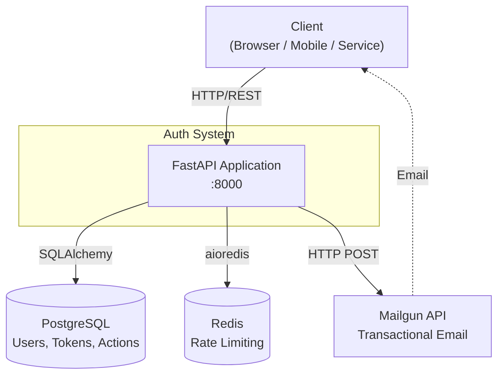
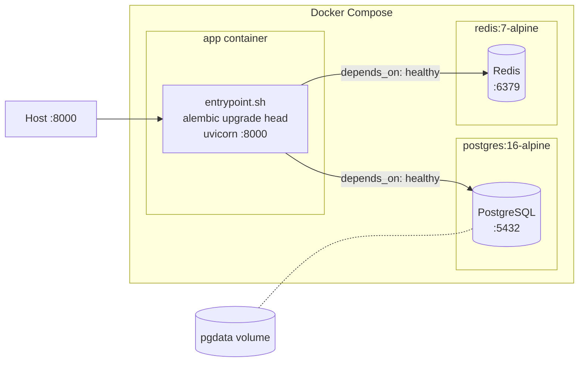
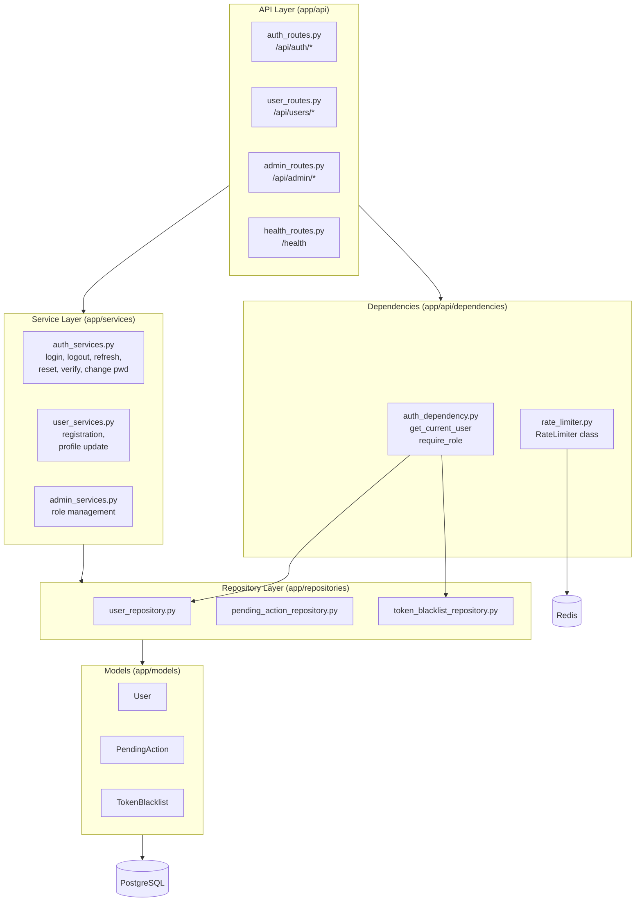
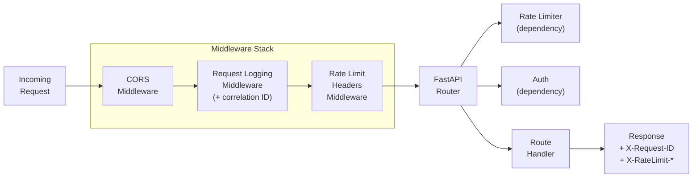
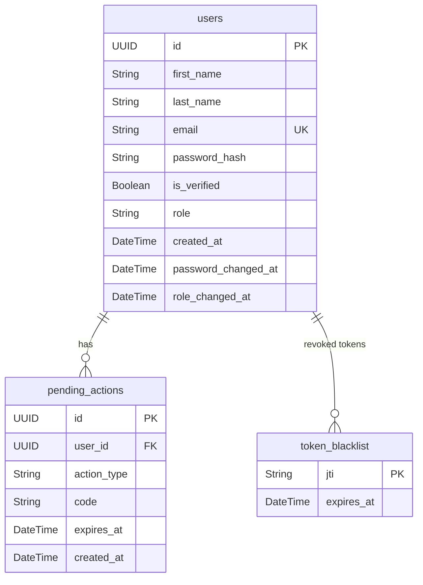
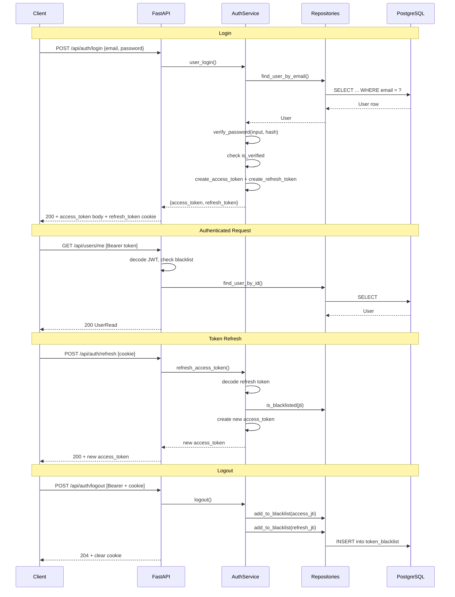
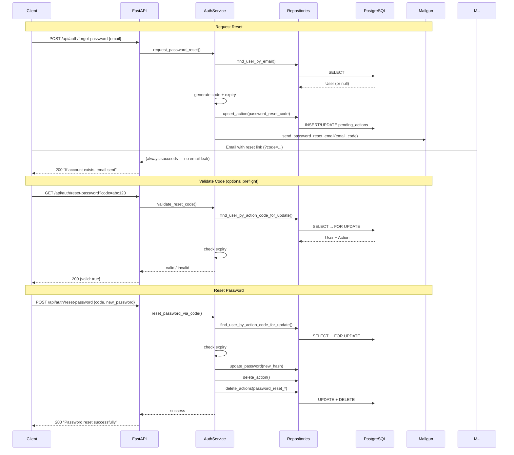
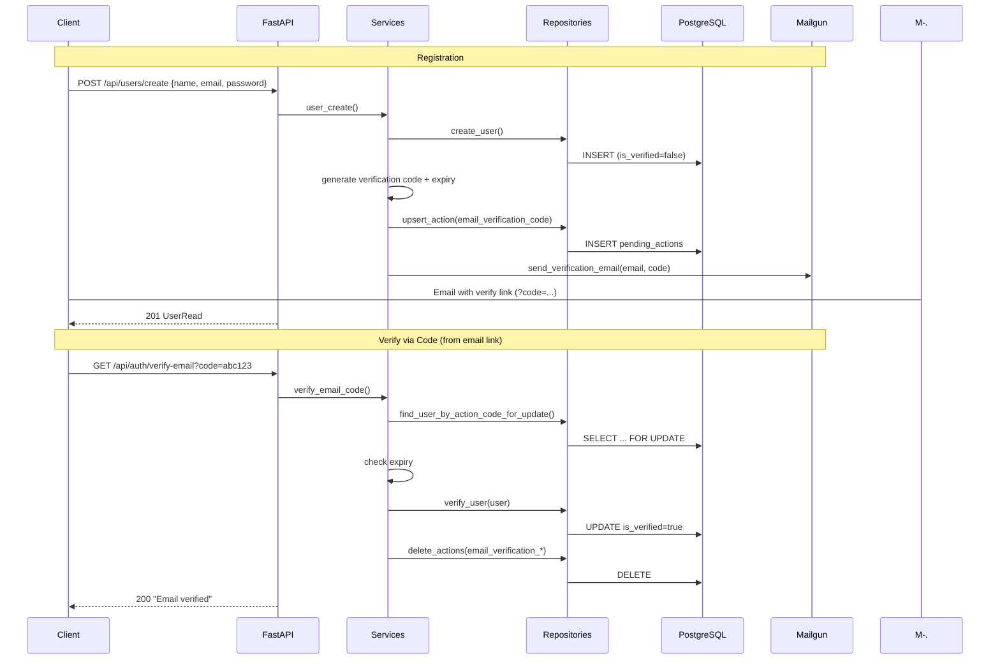
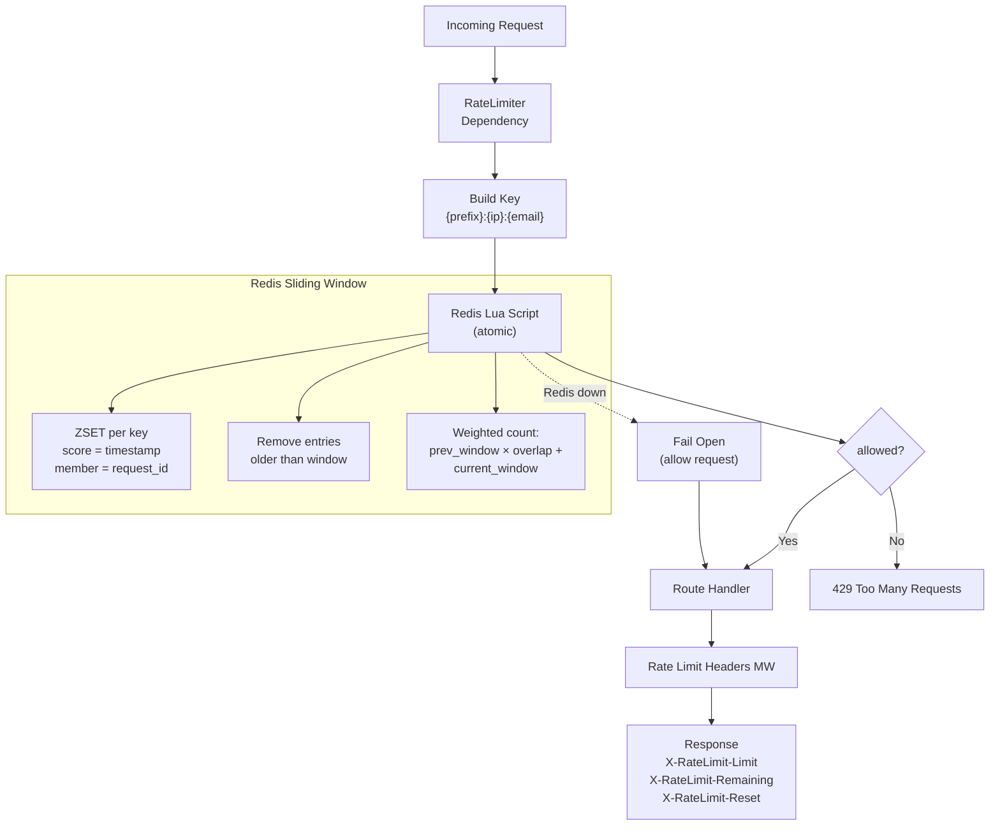
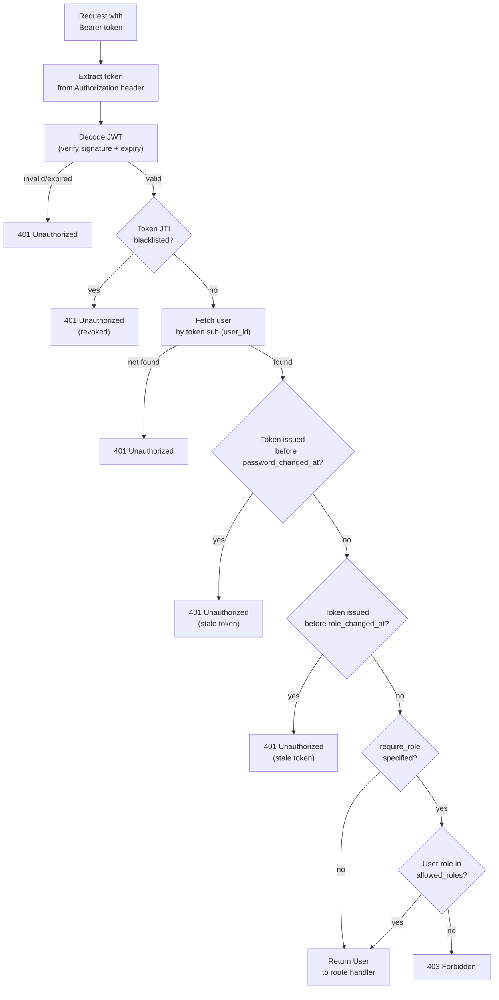

# Architecture Diagrams

## 1. System Context

High-level view of the auth-system and its external dependencies.

Show diagram

## 2. Docker Deployment

Container orchestration as defined in `docker-compose.example.yml`.

Show diagram

## 3. Application Layer Architecture

The service layer pattern: routes → services → repositories → database.

Show diagram

## 4. Middleware Pipeline

Order of middleware processing for every incoming request.

Show diagram

## 5. Database Schema

Entity-relationship diagram for all three models.

Show diagram

## 6. Authentication & Token Flow

Login, token refresh, and logout sequence.

Show diagram

## 7. Password Reset Flow

Forgot password → validate code → reset password.

Show diagram

## 8. Email Verification Flow

Registration → verify via code or token.

Show diagram

## 9. Rate Limiting Architecture

Redis sliding window implementation.

Show diagram

## 10. Auth Dependency & RBAC

How `get_current_user` and `require_role` validate every authenticated request.

Show diagram

